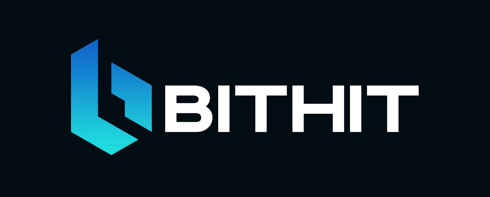
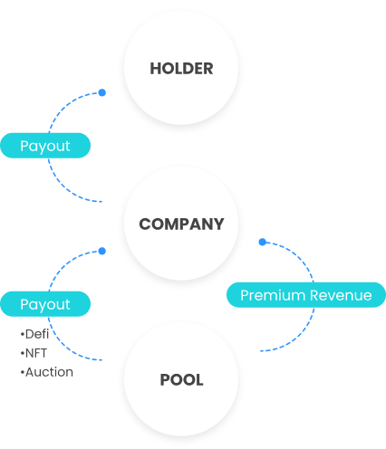
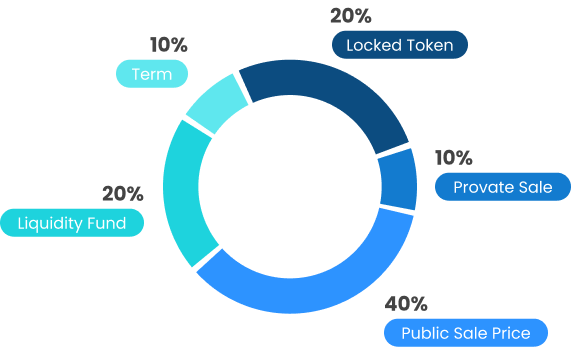

## What is BITHIT?

BITHIT is a platform for Web 3.0. This platform is built on Binance Smart Chain to offer scalability, low fees, and security.

BITHIT is a decentralized payment platform that utilize today's cryptocurrencies and which is about to happen for instant payment.

A smart payment process management service that acts as part of BITHIT’S contract service. As well as auctions for individual customers and business customers.

Token holders use BITHIT as a utility token to participate in the platform such as auctions and prize contract that offer as an income strategy. 

## BITHIT tools include:

BITHIT Service: Decentralized service for C2C, B2C, and B2B. And a smart payment process management service that function as a part of BITHIT’s contract service.

## Vision 

Auction decentralized services and payments processing based on institutional-grade smart contracts that eliminate the need for buyers and sellers to trust each other. BITHIT aims to provide a user-centered solution to secure online and face-to-face transactions while broadening payments acceptance options through integrated currencies. 

BITHIT commercial transactions to incentivize commitment and eliminates the trust deficit in the global marketplace.

### Introduction

BITHIT is bringing a new user experience to the global payments industry.

• Solution

• Multi-Currency Payment Processing

• Payments

• Marketplace

• Governance system

• Open Online Marketplaces, Service Providers, and e-Commerce Platforms.

Because started a new job are emerging online, more people are choosing independent work over traditional employment. Better protected payment solutions. 

Blockchain:  Moving toward wider adoption

Blockchain technology has gained tremendous recognition in the past three years.

The growth of the total number of blockchain wallets between
January 2018 and January 2021 (66 million people)

Recent interest in the blockchain ecosystem and cryptoassets from listed companies said that Changing perspective on digital assets. The target audience of the blockchain system is the transition from technology enthusiasts to large-scale institutional investors and individual investors. In addition, blockchain technology is becoming more flexible, and being more adaptable to global transaction landscape.

## Problem 

International transactions are costly
Cross-border B2B transactions will reach 35 trillion USD by 2022.

Due to the growth of international B2B transactions, people or even companies around the world is forced to rely on traditional payment infrastructure as well as money transfer. 90 percent of these customers targeting low cost. It is very necessary to understand and find a new transaction model that can replace the old model.

High fees in the P2P market
The current P2P market, auction and e-commerce platforms have commission structure that is too high. Platform users pay between 5 percent and 25 percent  in commission and fees for using these market.

## Solution

Blockchain tecEcosystem

 
Pay gas fees using supported tokens

Every transaction on Bithit can pay gas fees in BNB or Bithit which are tokens supported on the Binance Smart Chain, blockchain to perform transaction without needing to hold a Bithit token. Other than this, some payment amount may require a stablecoin or other supported tokens to make native transactions to enhance the user experience of the platform.
hnology is redefining operations in different industries. Expanding payment options through BITHIT token support to bring liquidity to the DeFi through the market, auction.

An ERC-20 token was issued that convert ERC-20 token to BITHIT tokens, supported on the Binance Smart Chain.

## Ecosystem

Pay gas fees using supported tokens

Every transaction on Bithit can pay gas fees in BNB or Bithit which are tokens supported on the Binance Smart Chain, blockchain to perform transaction without needing to hold a Bithit token. Other than this, some payment amount may require a stablecoin or other supported tokens to make native transactions to enhance the user experience of the platform.

### Service

Contract service utilizes smart contract for creating digital contract
Business agreement and peer to peer transactions. Provide a template contract that parties can use to fulfill their terms and conditions. When the basis of the term of the agreement is reached. Transactions will be performed automatically.

•	Allows businesses to make deals without having to trust each other.

•	Help businesses save money.

•	Help businesses become agile and fast.

•	Help increase liquidity of the business.

•	Offer automatic payment.

No need for third-party brokerage or the presence of other people

### How does BITHIT service work?

• Platform users can choose use between auction items or product items.

• Terms and conditions of the contract are subject to the stated conditions.

• Set and agreed. Buyer pay with smart contract using the BITHIT token or supported tokens. The sell will receive a notification and deliver products/services. Once the products or services have been delivered,the buyer will be assigned a predetermination.

• Inspection time period before accepting or rejecting shipment. Finally, the buyer accepts the product or service, BITHIT will be paid to the seller according to the contract.

• Inspection period before deal closes This give the buyers sufficient time to review and confirm the transaction.

• If there is a disagreement and the buyer refuses the shipment, the parties may negotiate to settle a dispute or initiate to settle a dispute resolution process on the platform
	
### Processing payment with cryptocurrency

BITHIT payment processing solution, promote the use of cryptocurrency with its own BITHIT token.
A gateway to new opportunity and rapid scalability. One of main challenges facing ,crypto community is support for the BITHIT.

Transaction fees and returns from transactions are used for:

- Buy back BITHIT from the market
- BITHIT’S income strategy
- Rewarding BITHIT holders
- Develop and hire more employee in the future
- Platform security system

Founder and Adviser of BITHIT
-Consist of successful entrepreneurs, experts, and a blockchain PhD researcher. Along with a team of smart contract security engineer, encryption experts, and experienced strategic growth leaders. 

BITHIT enables new economy partially accessible directly with web 3.0 function
 which is efficient.

Cryptocurrency payment that easily facilitates crypto transactions on app market and e-commerce platform to combine multiple cryptocurrency payment.

Payment contract service BITHIT, AUCTION, NFT and dispute resolution function that is easy to understand and secure.

### KYC Security

Information required to comply with KYC procedures. Our platform will showcase high-level safety features, including two-factor authentication high-level safety features, including two-factor authentication.

BITHIT is decentralized auction and trading market that products and services can be traded fast and easy, suitable for individual and business customers.

### Virtual assets
NFTs provide the ability to digitize real-world assets. The unique nature and public transaction history provide a strong use case for creating ownership certificates. 

NFT and Certificate of Ownership
BITHIT has a simple interface for generating a non-fungible token.

A non-fungible token is a non-interchangeable token with unique characteristics and public transaction history. BITHIT helps users create NFT conforms to the standard.

 #### NFT Use Cases

•NFTs render them useful for storing distinctive information, including art pieces and any other data.

•Digital art

•Collectibles

•Virtual assets

## Marketplace for the Web 3.0

NFTs provide the ability to digitize real-world assets. The unique nature and public transaction history provide a strong use case for creating ownership certificates.   

NFT and Certificate of Ownership BITHIT has a simple interface for generating a non-fungible token.  

A non-fungible token is a non-interchangeable token with unique characteristics and public transaction history. BITHIT helps users create NFT conforms to the standard.

BITHIT plans to launch a marketplace for auction and trading that makes a difference ,solution available through advance functionality including browser software cryptocurrency wallet , significantly lower fee-based multi-cryptocurrency support. Build-in reward system and an easy-to-use interface.  A marketplace that allows sellers to add products and services on the platform. Each item contains a product image, description, payment options.

The marketplace buyer system can automatically connect to any browser compatible wallet. During payment BITHIT has an instant payment option or make a contract for the transaction requesting acceptance.

Fundraising on Bithit platform is to increase liquidity for rewarded users. Fundraising is aimed at solving limitation for users. Rewarded users can register to raise funds on the Bithit platform.

Every specific funding project will have a project description and can create smart contract for participant. To deposit fund in the form of BITHIT token. A fundraising that specially allows other members to invest in their own store and receive rewards together on a proportionate basis.

Mobile BITHIT application will provide easy market access. The app
work similarly to the marketplace app. Mostly, allow users to view the product items , pictures, description, and rating. Bithit app will connect automatically when compatible with a wallet for payment and make it easy to track the transaction.

### Good Governance
BITHIT offers a standardized governance system, for every transaction decision.
BITHIT focuses on giving the community a strong user base. For the direction of BITHIT community development.

### BITHIT Token

Standard: BINANCE SMART CHAIN

Token Supply: 90,000,000,000

Initial Circulating Supply: 9,000,000 USD

Initial Market Cap: 90,000,000 USD

Pre-Sale Price: $ 0.0010 USD

Public Sale Price: $ 0.0012 USD

### Token distribution

Token Release Schedule

•Private Sale 10%

•Public Sale Price 40%

•Liquidity Fund 20%

•Team 10%

12 months fully locked then 25% quarterly
Unlocked and distributed as per incentive/governance event

BURN
Burn the coins earned from the 5% auction fee every quarter.  

### For more information and latest update here or these channels
Facebook: Twitter: Instagram: Telegram

